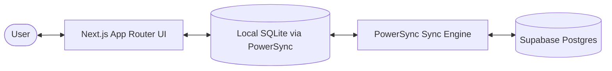

# Project Guide

This document is the technical reference for developers and coding agents working on Dash.

Use this together with:

- [README.md](../README.md) for product overview
- [SETUP.md](../SETUP.md) for environment setup, backend provisioning, and deployment

## Tech Stack

Next.js 16 · PowerSync · Supabase · Tailwind CSS v4 · Shadcn/UI · Tiptap 3.22.5 · KaTeX · Vitest · Serwist

## What Dash Is

Dash is an offline-first Next.js application with three primary apps under one shell:

- `Tasks` — todo management with subtasks, tags, due dates, priorities, trash/restore, and share-target capture
- `Tracker` — time-block logging on a 7-day x 24-hour grid, daily mood ratings, yearly heatmaps, and weekly widgets
- `Notes` — a local-first outline editor built on pages, blocks, graph edges, and explicitly owned attachments

Testing is organized separately under `tests/`, with app-group suites and shared helpers rather than colocated source tests.

The app is designed so the browser-local database is the primary runtime source of truth. UI reads and writes happen against local SQLite through PowerSync, and cloud sync happens in the background.

## High-Level Architecture



Key runtime behavior:

1. The app boots the local PowerSync-backed SQLite database first.
2. Once local DB init completes, the UI renders from cached local data.
3. Cloud sync is connected in the background and should not block initial UI paint.
4. Many writes are debounced or optimistic so the interface stays responsive even when sync is behind.

## Root App Structure

### App Router shell

- `src/app/layout.tsx`
  - Root HTML shell
  - Mounts `ThemeProvider`, `PowerSyncProvider`, and Vercel analytics
  - `<body>` carries `suppressHydrationWarning` because the pre-paint display-font script mutates its attributes before hydration
  - Defines the global full-height app layout
  - Loads the app's fonts via `next/font`: Inter (body), Lora (serif/journal), Geist Mono (code), plus the display candidates Fraunces / Hanken Grotesk / Bricolage Grotesque. Each exposes a CSS var; the active display face is applied by a small pre-paint inline script that sets `data-display-font` on `<body>` from `localStorage` (see [Typography](#typography-and-display-font))

- `src/components/powersync-provider.tsx`
  - Initializes local SQLite first with `initLocal()`
  - Only after local init succeeds does it render the app tree
  - Starts `connectCloud()` in the background so sync does not block the UI

### Shared shell components

- `src/components/AppHeader.tsx`
  - Shared sticky header used by app pages
  - Renders differently on mobile and desktop
  - Handles theme toggle, sync indicator, logout, and mobile overflow menu

- `src/components/AppSwitcher.tsx`
  - App-to-app switcher used in the shell
  - Uses the registry in `src/lib/shared/apps.ts`
  - Prefetches other app routes for faster handoff

- `src/components/MobileBottomFabs.tsx`
  - Shared mobile bottom shell used by tasks and tracker
  - Holds the app switcher plus app-specific primary actions

- `src/components/SyncIndicator.tsx`
  - Displays PowerSync connection/upload/download state
  - Used in the header so sync state is always visible

- `src/components/SettingsDialog.tsx`
  - Responsive settings surface (centered dialog on desktop, bottom drawer on mobile)
  - Sections: Account, Appearance (theme), Display font, Notifications (web push), Data (reset local data)
  - The Display font section uses `useDisplayFont` (see [Typography](#typography-and-display-font))

### Route-level loading behavior

- `src/app/tasks/loading.tsx`
  - Route-level fallback for navigation into tasks
  - Uses the real header shell plus tasks-specific skeleton content

- `src/app/tracker/loading.tsx`
  - Route-level fallback for navigation into tracker
  - Uses the real header shell plus tracker tab/body skeletons

Important convention:

- The header is treated as stable app chrome, not data-dependent content.
- Loading UI should generally appear below the real header when possible.

## Directory Map

### Routes

- `src/app/page.tsx` — the welcome dashboard (home/start page; see [Dashboard](#dashboard-structure))
- `src/app/login/page.tsx` — login page
- `src/app/share/page.tsx` — PWA share target review and save flow
- `src/app/tasks/page.tsx` — tasks dashboard
- `src/app/tracker/page.tsx` — tracker dashboard
- `src/app/notes/page.tsx` — notes dashboard shell

### Shared components

- `src/components/AppHeader.tsx`
- `src/components/AppSwitcher.tsx`
- `src/components/MobileBottomFabs.tsx`
- `src/components/SyncIndicator.tsx`
- `src/components/LogViewerDialog.tsx`
- `src/components/ManageNamedColorItemsDialog.tsx`
- `src/components/tags/*` — shared tag selection and pill-strip primitives used by tasks and notes
- `src/components/motion/*` — the shared Motion primitives (see **Motion system** below): `Reveal` (scroll reveal), `FadeIn` (entrance wrapper), `AnimatedList` + `MotionListItem` (staggered enter/exit lists), `Presence` (hand-rolled popover enter/exit). All honor reduced-motion.

### Dashboard components

- `src/components/dashboard/DashboardHero.tsx` — the centered hero (greeting, search bar, contextual action/mood)
- `src/components/dashboard/DashboardGreeting.tsx` — presentational greeting + date (one line on desktop)
- `src/components/dashboard/HeroAction.tsx` — the contextual nudge button (opens a task, scrolls to a section, or navigates)
- `src/components/dashboard/MoodPicker.tsx` — 1–5 mood dots writing to `daily_ratings` (night hero + shared)
- `src/components/dashboard/GlobalSearch.tsx` — controlled combined tasks+notes search (built on `SearchPopup`)
- `src/components/dashboard/TaskPopup.tsx` — opens a `TaskCard` in a blurred modal (tasks have no deep-link route)
- `src/components/dashboard/TodayTasks.tsx` / `TodayTracking.tsx` — borderless reveal widgets
- `src/components/dashboard/DashboardJournal.tsx` — embeds `WeeklyJournal` for the current week, editable in place
- `src/components/dashboard/AppsFab.tsx` — bottom horizontal app strip (single-click nav), on a blurred scrim

### Task-specific components

- `src/components/tasks/TaskCard.tsx`
- `src/components/tasks/TaskMetadataEditor.tsx`
- `src/components/tasks/ManageTagsDialog.tsx`
- `src/components/tasks/TasksPageSkeleton.tsx`

### Tracker-specific components

- `src/components/tracker/ActivityToolbar.tsx`
- `src/components/tracker/TimeGrid.tsx`
- `src/components/tracker/WeekNavigator.tsx`
- `src/components/tracker/WeekViewSkeleton.tsx`
- `src/components/tracker/WeeklyJournal.tsx`
- `src/components/tracker/YearActivityGrid.tsx`
- `src/components/tracker/YearRatingGrid.tsx`
- `src/components/tracker/ManageActivitiesDialog.tsx`
- `src/components/tracker/widgets/*`

### Notes-specific components

- `src/components/notes/NoteBlockEditor.tsx`
- `src/components/notes/NoteBlockEditorSlash.ts`
- `src/components/notes/NoteBlockEditorMath.ts`
- `src/components/notes/NotesBlockTree.tsx`
- `src/components/notes/BlockContextMenu.tsx`
- `src/components/notes/block-context-menu-options.ts`
- `src/components/notes/ManagePropertiesDialog.tsx`
- `src/components/notes/MobileRailDrawer.tsx`
- `src/components/notes/page/*`

### Library folders

- `src/lib/shared/apps.ts` — app registry used by header/switcher/FAB shell
- `src/lib/shared/auth.ts` — current-user lookup with session caching
- `src/lib/shared/share.ts` — parsing incoming share payloads and title generation
- `src/lib/shared/entity-store.ts` — generic base class for in-memory stores with dirty tracking, debounced persistence, and undo/redo
- `src/lib/shared/debounced-update.ts` — debounced local writes and execute batching
- `src/lib/shared/logger.ts` — runtime logging abstraction
- `src/lib/shared/ranked-order.ts` — reusable LexoRank ordering helpers that can be shared across app groups
- `src/lib/shared/utils.ts` — shared UI/class/date/escapeHtml helpers
- `src/lib/shared/display-font.ts` — display-font options, storage key, and the `isDisplayFont` guard (see [Typography](#typography-and-display-font))
- `src/lib/shared/greeting.ts` — pure time-of-day greeting pools + `timeOfDayForHour` (used by the dashboard hero and the next-best-action picker)
- `src/lib/shared/motion.ts` — the shared Motion vocabulary (durations, easings, spring, variants); the single source of truth for animation feel, mirrored by the CSS `--motion-*` tokens (see [Motion system](#motion-system))
- `src/lib/dashboard/hero-action.ts` — pure rule+weighted-score picker (`chooseHeroAction`) for the hero's contextual nudge
- `src/lib/tasks/colors.ts` — tag palette and class maps
- `src/lib/tasks/tasks.ts` — priority and due-date helpers
- `src/lib/tasks/tags.ts` — tag creation helpers
- `src/lib/tracker/activities.ts` — tracker activity palette and class maps
- `src/lib/tracker/ratings.ts` — `setDailyRating` upsert (insert/update/clear) for the mood picker, shared by the dashboard
- `src/lib/tracker/day-keys.ts` — UTC-naive/local date-key helpers, incl. `recentNaiveWindow` for the "logged in the last 2h" check
- `src/hooks/use-notes.ts` — local SQLite query hooks for note pages and blocks (excludes `properties.kind`-tagged system pages from Notes lists)
- `src/hooks/use-display-font.ts` — reads/writes the selected display font via `useSyncExternalStore` + `localStorage`, applying it to `<body data-display-font>`
- `src/hooks/use-settled-timestamp.ts` — debounced timestamp display that waits for pending writes to settle
- `src/hooks/use-edge-swipe.ts` — mobile edge swipe gesture detection
- `src/hooks/use-page-nav-stack.ts` — page navigation stack with sessionStorage persistence (used by breadcrumb)
- `src/hooks/use-property-definitions.ts` — reactive query hook for workspace property definitions
- `src/hooks/use-optimistic-value.ts` — generic optimistic-override hook (keyed on a serialized upstream snapshot) for edits that render before a DB write round-trips
- `src/hooks/use-greeting.ts` — snapshots the greeting/date once per mount (single seed shared by hero + collapsed top bar)
- `src/hooks/use-hero-action.ts` — gathers live signals (tasks, recent tracking, mood, journal) and returns the chosen hero action + most-relevant task
- `src/lib/notes/notes-content.ts` — note document normalization, serialization (including math nodes), and plain-text extraction
- `src/lib/notes/notes-tree.ts` — tree building and visible block ordering helpers for note blocks
- `src/lib/notes/note-block-store.ts` — per-page block store with cached persistence, reconcile fast-path, undo/redo, and query block content support
- `src/lib/notes/query-block-content.ts` — encode/decode codec between the query UI's `QueryBlockConfig` and the stored note document (config lives in a `queryBlock` node's attrs)
- `src/lib/notes/notes.ts` — note page CRUD, metadata writes, attachment upserts, edge reconciliation, and system-page helpers (`ensureSystemPage`, `pruneEmptyJournalPages`)
- `src/lib/notes/system-pages.ts` — deterministic ids for "system pages": notes pages tagged with `properties.kind` (e.g. `journal`) and located by `uuidv5(kind:userId:key)`, so features can reuse the notes store while staying hidden from `/notes`
- `src/lib/notes/math-clipboard.ts` — math token protection/restoration for clipboard paste flows
- `src/lib/notes/block-editor-keyboard.ts` — keyboard decision logic for Enter, Backspace, Tab, and arrow keys in the block editor
- `src/lib/notes/page-nav-stack.ts` — pure push/pop/popTo logic for the page breadcrumb stack
- `src/lib/notes/properties.ts` — CRUD operations for property definitions and custom property value parsing

### PowerSync integration

- `src/lib/powersync/AppSchema.ts` — local schema definition
- `src/lib/powersync/db.ts` — database instance, init, connect, reconnect, reset
- `src/lib/powersync/SupabaseConnector.ts` — sync connector implementation

### Tests

- `tests/notes/*` — notes-specific Vitest suites
- `tests/tasks/*` — task-specific Vitest suites
- `tests/tracker/*` — tracker-specific Vitest suites
- `tests/shared/*` — shared fixtures, builders, and assertions reused across app groups
- `tests/README.md` — current suite map and short descriptions of what each test file covers

### Notes App Structure

Primary route:

- `src/app/notes/page.tsx`

Responsibilities:

- Registers the notes app in the shared shell and launcher.
- Orchestrates overview and editor surfaces via `?page=` route state.
- Reads pages, blocks, backlinks, attachments, and mentions from local SQLite through `src/hooks/use-notes.ts`.
- Resolves note page tag ids from `pages.properties.tags` through the shared `tags` table.
- Supports custom page properties stored in `pages.properties.custom`, resolved against workspace-wide `property_definitions`.
- Uses `ManagePropertiesDialog` for workspace-wide property definition CRUD (create, rename, delete, emoji icons, and select-option editing).
- Preserves the shared header-first loading model used across the app.
- Block state is managed by `NoteBlockStore` — an in-memory store with dirty tracking, debounced batched persistence, and undo/redo.

Key modules:

- `src/components/notes/page/*`
  - Route-local overview, navigation, details, search, and supporting notes hooks.
  - Includes the notes editor header metadata row, which reuses the shared tag selector and tag pill strip.

- `src/components/notes/NoteBlockEditor.tsx`
  - Per-block Tiptap editor with markdown-style transforms, block key handling, local/external content reconciliation, a table contextual toolbar for focused-cell column and row actions, a code block toolbar with language selector and copy button, and math-aware copy/paste handling.

- `src/components/notes/NoteBlockEditorExtensions.ts`
  - Custom Tiptap extensions: reference decorations, date auto-format, markdown link parsing, notes-specific horizontal rule and arrow replacement.

- `src/components/notes/NoteBlockEditorSlash.ts`
  - Slash command definitions plus query, filtering, and grouping helpers used by the block editor. Includes a `/math` command for inserting display math blocks.

- `src/components/notes/NoteBlockEditorMath.ts`
  - Tiptap extensions for inline math (`$...$`) and block math (`$$...$$`). Provides atom nodes with KaTeX rendering, click-to-edit NodeViews, and input rules.

- `src/components/notes/NotesBlockTree.tsx`
  - Nested visible block tree, block navigation wiring, sibling creation plumbing, block move controls (Alt+arrow), selection handling, and tree-line indentation from block to bullet.

- `src/lib/shared/entity-store.ts`
  - Generic base class for in-memory entity stores with dirty tracking, debounced persistence, and undo/redo stack.

- `src/lib/notes/note-block-store.ts`
  - Per-page block store built on EntityStore. Manages block nodes, Tiptap editor refs, cached ordered blocks, content cache with reconcile fast-path, batched write transactions, full redo for all commands, and direct content updates for non-editor blocks (query blocks).
  - All block content shares one shape — a normalized note document. Query blocks store their config inside a `queryBlock` node's attrs (via `src/lib/notes/query-block-content.ts`) rather than as a special opaque payload, so the store never special-cases query content.

- `src/components/notes/page/useNoteBlockStoreActions.ts`
  - React hook connecting NoteBlockStore to the component tree via `useSyncExternalStore`. Provides all block mutation callbacks (create, delete, split, merge, indent, outdent, move, content update, undo/redo).

- `src/lib/notes/block-styling.ts`
  - Block spacing metadata, per-heading-level accent color, divider styling, and tree-line color utilities.

- `src/lib/notes/editor-serialization.ts`
  - Markdown/HTML serialization, clipboard text detection, table/image parsing, and turndown configuration.

- `src/lib/notes/editor-document-helpers.ts`
  - Editor document manipulation: splitting, parsing, position resolution, and page reference query.

- `src/lib/notes/editor-token-protection.ts`
  - Token protection/restoration for note reference tokens during markdown conversion.

- `src/lib/notes/property-helpers.ts`
  - Property definition config parsing, property resolution, and option badge styling.

- `src/components/notes/NotesBlockTree.tsx`
  - Nested visible block tree, block navigation wiring, sibling creation plumbing, block move controls (Alt+arrow), selection handling, and tree-line indentation from block to bullet.

- `src/components/notes/BlockContextMenu.tsx`
  - Block-level right-click context menu with actions for type conversion, move, indent/outdent, delete, and duplication.

- `src/components/notes/block-context-menu-options.ts`
  - Context menu option generation logic, providing block-type-aware action lists including block color.

- `src/components/notes/NotesPageBreadcrumb.tsx`
  - Breadcrumb navigation trail rendered in both desktop header and mobile bottom FAB. Shares a single nav stack managed by `src/hooks/use-page-nav-stack.ts` with sessionStorage persistence.

- `src/components/notes/QueryBlockView.tsx` / `QueryBlockFilters.tsx` / `QueryBlockCells.tsx`
  - Inline query block UI: filter builder, column selector, sorting, and cell renderers. Query blocks display filtered views of pages with property columns.
  - Config is encoded/decoded through `src/lib/notes/query-block-content.ts`; the result table sizes columns from shared width constants so rows span the full scrollable width.
  - Inline cell and tag edits are optimistic via `src/hooks/use-optimistic-value.ts`, and tag cells reuse the shared `TagSelector`.

- `src/components/notes/MobileRailDrawer.tsx`
  - Shared mobile drawer shell for the notes rails.

- `src/components/notes/page/NotesPagePeek.tsx`
  - Page peek preview shown on hover (desktop) or long-press (mobile) over page reference links.

Additional notes editor behavior:

- **Sticky headings** — heading blocks stick to the top of the scroll viewport for orientation in long documents.
- **Block colors** — blocks can be assigned a background color via the context menu. Colors persist per-block.
- **Date tokens** — slash commands (`/today`, `/tomorrow`, `/date`) insert styled inline date tokens.
- **Focused bullet highlight** — the bullet dot highlights when a block's editor is focused.
- **Tree-line coloring** — vertical indentation lines inherit the nearest heading's accent color.
- **Emoji icons** — pages and property definitions use a Fluent Emoji Flat picker for visual identity.

Conventions:

- Keep `src/app/notes/page.tsx` as the route orchestrator and state wiring layer.
- Move reusable route-local UI and hooks into `src/components/notes/page/` before expanding the route file.
- Keep editor-owned helpers alongside the editor when they are specific to note block behavior.
- Attachments are owned by either a page or a block, never both.
- Blocks are lazy-mounted via `IntersectionObserver` and settle via `onEditorCreate` callback, not MutationObserver.
- Page navigation triggers an entrance animation; the skeleton/settled state resets on each page switch.

### Custom Page Properties

The notes app supports Notion-style custom properties per page:

- **Schema**: `property_definitions` table holds workspace-wide definitions (name, type, config with optional icon and select options).
- **Per-page values**: Stored in `pages.properties.custom` as `{ [definitionId]: value }`.
- **Supported types**: text, number, date, select, checkbox, url.
- **UI**: `src/components/notes/page/NotePageProperties.tsx` renders a collapsible properties section below the page title with inline editors per type.
- **Management**: `src/components/notes/ManagePropertiesDialog.tsx` provides workspace-wide property definition CRUD with emoji picker, type selector, and select-option editing. Available on desktop via the header and on mobile via the 3-dots menu.
- **Data flow**: `src/lib/notes/properties.ts` handles definition CRUD and value parsing. `src/hooks/use-property-definitions.ts` provides reactive query access.

## Dashboard Structure

The home route (`src/app/page.tsx`) is the welcome dashboard and the app's `start_url`. It is its own scroll container (`absolute inset-0 overflow-y-auto`, positioned so Motion's `useScroll({ container })` can measure it) with `scroll-snap` between the hero and the reveal.

Responsibilities and behavior:

- **Hero collapse (Motion):** `useScroll` + `useTransform` map the container's raw `scrollY` (px) to a fade/scale on the hero and a fade-in of a compact greeting + search icon in the sticky top bar. Driven by raw `scrollY` (not a measured target) to avoid feedback from the hero's own transforms; bidirectional (reverses on scroll up).
- **Reveal:** each section is wrapped in `motion/Reveal` (`whileInView`, once) with the container as `root`; reduced-motion renders them static.
- **Contextual hero action:** `useHeroAction` gathers signals — pending/overdue/due-today tasks (and the most-relevant one), whether time was logged in the last 2h (`recentNaiveWindow`), whether mood was rated today, and whether this week's journal system page exists — and feeds the pure `chooseHeroAction` picker (`src/lib/dashboard/hero-action.ts`). At night it shows `MoodPicker`; otherwise a single `HeroAction` nudge (most-relevant task → task modal, plan → scroll to `#today-tasks`, track → `/tracker`, journal → scroll to `#weekly-journal`).
- **Search:** `GlobalSearch` is controlled (opened by the hero bar, the top-bar icon, or ⌘K), filters tasks by title and notes via `useNotesPageDerivedState`, and reuses `SearchPopup`. Notes deep-link to `/notes?page=`; tasks open in `TaskPopup`.
- **Journal:** `DashboardJournal` embeds the tracker's `WeeklyJournal` for the current week (same `systemPageId`), editable in place.
- **Apps:** `AppsFab` is a fixed bottom strip of single-click app links over a blurred scrim (replaces the old floating `AppSwitcher` FAB here).
- Greeting text comes from `useGreeting` (one seed shared by hero + collapsed bar). There is no route restoration — the app always opens on the dashboard.

## Tasks App Structure

Primary route:

- `src/app/tasks/page.tsx`

Responsibilities:

- Runs the main task list query and tag filter query from local SQLite
- Maintains local UI filter state for task state, priority, tag filters, and pagination
- Keeps optimistic draft tasks in memory before they are persisted
- Renders the shared header plus a tasks-specific filter row
- Uses `TaskCard` for task editing and subtask management
- Uses `ManageTagsDialog` for tag CRUD
- Uses `MobileBottomFabs` for the floating add action on mobile

Important child components:

- `src/components/tasks/TaskCard.tsx`
  - Owns inline task editing behavior
  - Handles title, priority, due date, tags, state changes, and subtasks
  - Uses `debouncedUpdate()` for merged updates
  - Uses optimistic local state for deletes and subtasks

- `src/components/tasks/TaskMetadataEditor.tsx`
  - Shared due-date and tag picker row
  - Used inside both task editing and the `/share` task creation flow

- `src/components/tasks/ManageTagsDialog.tsx`
  - Thin wrapper around the shared named-color CRUD dialog
  - Tags persistence still uses the tags helper in `src/lib/tasks/tags.ts`

- `src/components/tasks/TasksPageSkeleton.tsx`
  - Shared loading primitives for tasks route fallback and in-page loading state

Tasks page loading model:

- Route navigation into `/tasks` uses `src/app/tasks/loading.tsx`
- In-page initial query loading uses `TasksFilterRowSkeleton` and `TasksContentSkeleton`
- The header remains real chrome instead of being skeletonized

## Tracker App Structure

Primary route:

- `src/app/tracker/page.tsx`

Responsibilities:

- Loads activity types, time logs, and daily ratings from local SQLite
- Manages three tracker views: `week`, `activity`, and `mood`
- Keeps optimistic in-memory overlays for time log and rating changes
- Uses URL search params for the active tracker subview (`?view=...`)
- Renders the shared header and a tracker-specific tab strip
- Uses `ManageActivitiesDialog` for activity CRUD

Important child components:

- `src/components/tracker/ActivityToolbar.tsx`
  - Activity selection row for painting the week grid

- `src/components/tracker/TimeGrid.tsx`
  - Main 7-day x 24-hour time grid
  - Clicking a cell writes or clears a time log entry

- `src/components/tracker/WeekNavigator.tsx`
  - Desktop header navigator plus mobile FAB navigator

- `src/components/tracker/WeekViewSkeleton.tsx`
  - Shared skeleton for the week view body

- `src/components/tracker/YearActivityGrid.tsx`
  - Year heatmap for tracked activity

- `src/components/tracker/YearRatingGrid.tsx`
  - Year calendar heatmap for daily mood ratings

- `src/components/tracker/ManageActivitiesDialog.tsx`
  - Thin wrapper around the shared named-color CRUD dialog

- `src/components/tracker/widgets/*`
  - Weekly analytics and summaries used below the grid

- `src/components/tracker/WeeklyJournal.tsx`
  - Per-week journal rendered below the widgets in the Week view
  - Each week maps to one lazily created notes "system page" (`kind: "journal"`, keyed by the Monday date via `systemPageId`), reusing the notes block editor (`useNoteBlocks` + `useNoteBlockStoreActions` + `NotesBlockTree`)
  - Stays mounted across weeks (user id fetched once); the inner editor is keyed by page id so it re-hydrates per week
  - Opportunistically calls `pruneEmptyJournalPages(currentPageId)` on week change to clean up untouched empty weeks; never deletes the open week's page (StrictMode-safe)

Tracker loading model:

- Route navigation into `/tracker` uses `src/app/tracker/loading.tsx`
- Within the page, `loadingActivities || loadingLogs` shows `WeekViewSkeleton` for the week view body
- The shared header remains real chrome during route loading

## Shared Named-Color CRUD Pattern

The tag and activity management dialogs now share one reusable primitive:

- `src/components/ManageNamedColorItemsDialog.tsx`

This component owns:

- dialog open behavior
- create input and color picker UI
- optimistic create overlays
- optimistic color updates
- delete confirmation dialog before removing items
- reconciliation between optimistic and persisted rows

It is wrapped by:

- `src/components/tasks/ManageTagsDialog.tsx`
- `src/components/tracker/ManageActivitiesDialog.tsx`

The shared tag selection UI lives separately in:

- `src/components/tags/TagSelector.tsx`
- `src/components/tags/TagPillStrip.tsx`

Tasks and notes both resolve against the same `public.tags` rows, so changes to tag names or colors should be reflected consistently across both apps.

If one of these dialogs breaks, start with the shared component first.

## Share Flow

Route:

- `src/app/share/page.tsx`

This route is the PWA web share target. It:

- reads incoming share params with helpers from `src/lib/shared/share.ts`
- builds an initial task title from the payload
- reuses `TaskMetadataEditor` for due date and tags
- inserts a task directly into local SQLite and then routes the user back to `/tasks`

## Data And Write Flow

### Read path

- UI components use `useQuery()` from `@powersync/react`
- Queries read from local SQLite, not directly from Supabase
- This keeps the UI fast and available offline

### Write path

There are three common write patterns:

1. Direct local execute
   - Used when the action should persist immediately
   - Example: some direct inserts/deletes via `db.execute()`

2. Debounced field updates
  - Implemented in `src/lib/shared/debounced-update.ts`
   - Used when rapid repeated edits should merge into one update
  - Important for task editing and notes page metadata updates

3. Entity store persistence
   - Implemented in `src/lib/shared/entity-store.ts` and `src/lib/notes/note-block-store.ts`
   - Used for notes block persistence — dirty blocks are batched into a single write transaction after a debounce window
   - The store owns the content cache and protects in-flight writes from being overwritten by stale reconcile events
   - Before writing, current block state is compared against the DB so net-zero churn (e.g. edit + undo within the debounce window) writes nothing
   - Pending create/delete deltas are cleared only after the write transaction commits, so a failed flush leaves them pending for a future retry instead of being dropped

4. Debounced execute batching
  - Also implemented in `src/lib/shared/debounced-update.ts`
   - Used for insert-like or one-shot writes that should batch and dedupe

Important implementation notes:

- Pending updates are keyed by `table:id`, not just `id`
- `flushAllUpdates()` flushes queued executes before updates
- `tasks`, `pages`, and `blocks` are currently treated as having `updated_at`

## Auth And User Context

- `src/lib/shared/auth.ts` exposes `getCurrentUserId()`
- Many create flows fetch the user id before local writes
- `src/components/AppHeader.tsx` handles logout through Supabase client auth

## App Registry And Visual Identity

- `src/lib/shared/apps.ts` is the central registry for each app's route, name, icon, and accent colors
- The header, switcher, and mobile FAB shell all rely on this registry
- If a new app is added, start there first

The notes app follows that same pattern, so new shell behavior should extend the shared primitives instead of introducing app-only chrome.

## Motion System

Animation is standardized on the [Motion](https://motion.dev) library (`motion/react`) with one shared vocabulary so the whole app feels consistent (calm and subtle: short durations, one house easing curve, small offsets).

**Tokens (single source of truth):** `src/lib/shared/motion.ts` exports `DURATION` (`fast` 0.12 / `base` 0.2 / `slow` 0.4s), `EASE` (`standard` = the house curve `[0.2, 0.9, 0.2, 1]`, `exit`), `SPRING_SOFT` (micro-interactions), `STAGGER_STEP`, and reusable variants (`fadeSlideUp`, `staggerContainer`/`staggerItem`, `popoverPresence`). It is pure (no `motion/react` import) so it is unit-tested in the node project. The same values are mirrored as CSS custom properties (`--motion-duration-*`, `--motion-ease-*`, `--motion-stagger-step`) in `globals.css`, which the CSS animation utilities (`.animate-fade-slide-in`, `.animate-stagger`, `.transition-smooth`, …) consume.

**Primitives (`src/components/motion/`):** `Reveal` (scroll-triggered `whileInView`), `FadeIn` (mount entrance — the Motion replacement for `.animate-fade-slide-in`), `AnimatedList` + `MotionListItem` (staggered enter/exit lists, replaces `.animate-stagger`; pass `layout={false}` inside CSS `columns` containers where FLIP is unreliable), and `Presence` (enter/exit for hand-rolled popovers). Prefer these over new bespoke animation code.

**Reduced motion:** every primitive gates on `useReducedMotion()` and renders a static element when reduced motion is preferred. `globals.css` also has a global `@media (prefers-reduced-motion: reduce)` block that neutralizes all CSS animations/transitions, so both mechanisms are covered.

**Where it's applied:** dashboard hero (scroll collapse + reveal), task list add/remove/complete (`AnimatePresence` on the tasks masonry + `TaskCard` exit — the DB delete is immediate and the card animates out as it unmounts), subtask and complete-toggle/mood micro-interactions, custom popover exits (`PagePeekPopover`, `DayPopover`, `BlockContextMenu`), the tracker view tabs (a `layoutId` underline + content crossfade), and skeleton→content fade-in. The Base UI / vaul / cmdk overlays keep their existing CSS `data-open`/`data-closed` enter/exit (converting them would fight the libraries' own mount control), and the notes overview↔editor swap keeps its purpose-built crossfade (an `AnimatePresence` there would remount the Tiptap editor).

**Testing:** DOM tests set `MotionGlobalConfig.skipAnimations = true` and stub `window.matchMedia` in `tests/setup/dom.ts` (wired via `setupFiles` in `vitest.dom.config.ts`) so `AnimatePresence` exits resolve synchronously and `useReducedMotion()` works under jsdom.

## Typography and Display Font

The type system has four roles, all wired through Tailwind v4 tokens in `src/app/globals.css` and loaded via `next/font` in `src/app/layout.tsx`:

- **Body** — Inter (`font-sans`), the global default.
- **Display / heading** — user-selectable (`font-heading` → `--font-heading`): Fraunces (default), Hanken Grotesk, Lora, or Bricolage Grotesque. Applied to wordmarks, page titles, section headers, dialog titles, tracker tabs, and tasks filter pills.
- **Soft / reflective** — Lora (`font-serif`): the weekly journal, plus greetings/mottos and a few empty states.
- **Mono** — Geist Mono (`font-mono`): notes code/query blocks, math inputs, log viewer.

Tracker numerals additionally use `tabular-nums` so digits align in columns.

Display-font switching:

- Each candidate exposes its own next/font CSS var (`--font-fraunces`, `--font-hanken`, `--font-serif` for Lora, `--font-bricolage`), applied to `<body>`.
- `--font-heading` is defined on `body` (not `:root`) and overridden by `body[data-display-font="…"]` rules. It must be on `body` because custom properties resolve `var()` against the declaring element, and the per-font vars live on `<body>`.
- `src/hooks/use-display-font.ts` (`useSyncExternalStore` + `localStorage`) writes the choice; a pre-paint inline script in the layout applies it before first paint to avoid a flash. Default (Fraunces) uses no attribute.
- Config and the `isDisplayFont` guard live in `src/lib/shared/display-font.ts`; the picker UI is the Display font section of `SettingsDialog`.

## PowerSync

- `src/components/powersync-provider.tsx` intentionally waits only for local init before rendering the app
- Cloud sync happens after the app is already usable
- `src/lib/powersync/db.ts` exposes `initLocal()`, `connectCloud()`, `reconnectCloud()`, and `resetLocalDatabase()`

This is one of the most important architectural choices in the codebase:

- local DB ready == UI may render
- cloud connected != required for first paint

## Debugging Entry Points

If you are debugging behavior in this repo, start from the narrowest owning surface:

- navigation or app shell issues: `AppHeader`, `AppSwitcher`, `MobileBottomFabs`, route `loading.tsx`
- tasks editing issues: `TaskCard.tsx`, `TaskMetadataEditor.tsx`, `debounced-update.ts`
- tag/activity dialog issues: `ManageNamedColorItemsDialog.tsx` first, then the wrapper dialog file
- tracker week grid behavior: `tracker/page.tsx`, `TimeGrid.tsx`, `ActivityToolbar.tsx`
- sync/bootstrap issues: `powersync-provider.tsx`, `src/lib/powersync/db.ts`, `SupabaseConnector.ts`

A few repo-specific patterns matter repeatedly:

- Notes blocks use an in-memory store (`NoteBlockStore`) that owns local state and reconciles against PowerSync reactive queries.
- Other views use optimistic local state on top of PowerSync query data.
- Route loading uses real header chrome where possible and skeletonizes only the content below it.
- Mobile dialogs launched from overflow menus are opened outside the dropdown subtree to avoid key input problems.
- The app intentionally favors local responsiveness over immediate cloud confirmation.

## Common Validation Commands

```bash
bun run dev
bun run build
bun run lint
bun run test
bun run test:dom
bunx tsc --noEmit
```

### Testing

Vitest is split between fast node-based suites and a jsdom integration layer for hook-level and DOM-adjacent behavior.

- `tests/notes/` — notes-specific tests
- `tests/tasks/` — task-specific tests
- `tests/tracker/` — tracker-specific tests
- `tests/shared/` — reusable fixtures, builders, and assertions shared across app groups

Primary commands:

- `bun run test` runs the default node-based suites.
- `bun run test:dom` runs the jsdom-backed integration suites.

See [tests/README.md](../tests/README.md) for the current suite map.

### Project Organization

- `src/app/` — App Router routes for launcher, tasks, tracker, notes, login, and share-target flows
- `src/components/` — shared shell UI plus app-specific task, tracker, and notes components
- `src/lib/shared/`, `src/lib/tasks/`, `src/lib/tracker/`, `src/lib/notes/` — helpers grouped by responsibility
- `src/lib/powersync/` — local SQLite schema, database bootstrap, and sync connector
- `tests/` — Vitest suites grouped by app plus shared test helpers

Feature entry points:

- `src/app/tasks/page.tsx` + `src/components/tasks/`
- `src/app/tracker/page.tsx` + `src/components/tracker/`
- `src/app/notes/page.tsx` + `src/components/notes/page/` + `src/components/notes/NoteBlockEditor.tsx`

## When To Update This Document

Update this guide when any of the following changes:

- a route gets a major structural rewrite
- shared shell behavior changes
- data flow or sync behavior changes
- a reusable component becomes the main owner of a workflow
- optimistic update or loading-state patterns change